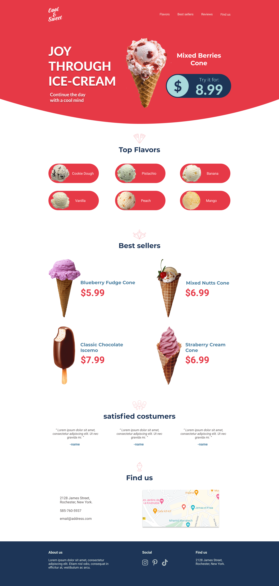
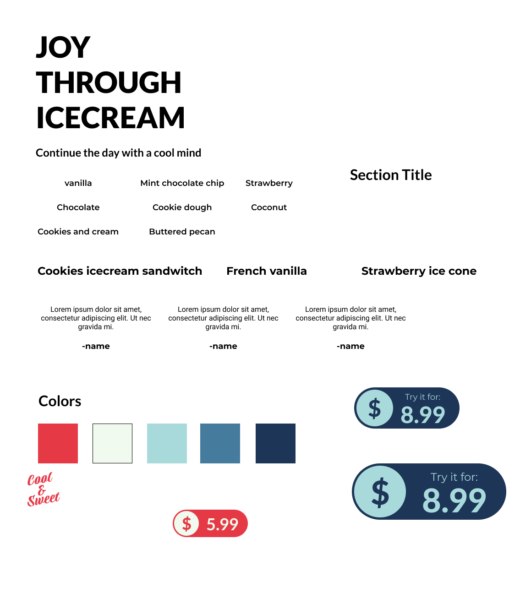

# Cool & Sweet ice-cream shop website

Cool & Sweet is a fictional ice-cream website designed and coded by me.

## Design

### Goals:

1. Display design skills and ability to follow design with code.
2. Show technology stack.
3. Create a website that best displays a clients services/products

### Technologies used:

- FIGMA

- HTML

- SCSS(CSS)

  - SASS maps
  - SASS mixins
  - SASS variables
  - SASS functions

- JavaScript

  - Javascript APIs(google maps)
  - Javascript events
  - Responsive menu
  - Functional map

- Parcel Bundler
